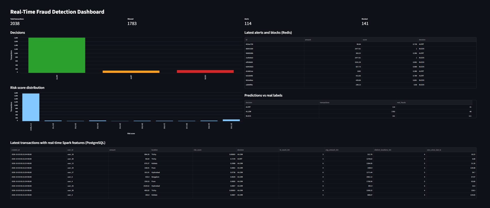

# Real-Time Fraud Detection Pipeline

A streaming pipeline that scores card transactions for fraud as they arrive, using Apache Kafka, Spark Structured Streaming, an XGBoost model, PostgreSQL, Redis and a live Streamlit dashboard.



## How it works

```
Transaction stream (producer)
            |
        Apache Kafka  (topic: transactions)
            |
   Spark Structured Streaming (Docker)
   real-time features per user, last 5 minutes
   (Redis holds each user's recent activity)
            |
        Apache Kafka  (topic: enriched_transactions)
            |
   Python consumer + XGBoost model
            |
        Risk score (0 to 1)
        /      |       \
   ALLOW     ALERT     BLOCK
  (< 0.30)  (0.30-0.80)  (>= 0.80)
        \      |       /
   PostgreSQL (history) + Redis (live counters, recent alerts)
            |
   Streamlit dashboard
```

### Real-time features (computed by Spark)

For every transaction, the Spark job looks at that user's previous 5 minutes of activity and adds four fields:

- `tx_count_5m`: number of transactions in the last 5 minutes
- `avg_amount_5m`: average amount in the last 5 minutes
- `distinct_locations_5m`: number of different locations used
- `secs_since_last_tx`: seconds since the user's previous transaction (-1 for a first transaction)

## Tech stack

- **Streaming:** Apache Kafka (Docker)
- **Stream processing:** Apache Spark Structured Streaming (Docker), PySpark
- **Model:** XGBoost with a scikit-learn preprocessing pipeline
- **Storage:** PostgreSQL (all predictions and features), Redis (user activity windows, counters and latest alerts)
- **Dashboard:** Streamlit and Altair
- **Language and tools:** Python, Docker Compose, Git

## Model selection

Three models were compared with 5-fold stratified cross-validation on 1,000 transactions (about 10% fraud). Accuracy is misleading on imbalanced data, so the comparison uses PR-AUC and F1.

| Model | ROC-AUC | PR-AUC | Precision | Recall | F1 |
|---|---|---|---|---|---|
| Logistic Regression | 0.887 | 0.639 | 0.370 | 0.77 | 0.500 |
| Random Forest | 0.913 | 0.683 | 0.893 | 0.25 | 0.391 |
| **XGBoost** | 0.904 | **0.695** | 0.635 | 0.66 | **0.647** |

XGBoost had the best PR-AUC and F1, so it was chosen. Precision and recall above are at a 0.50 threshold. The differences between the models are small on a dataset this size.

## Decision thresholds

The risk score is split into three zones, chosen from the cross-validated precision/recall table. They are stored in `config.json`, so they can be changed without touching the code.

| Risk score | Decision | Meaning |
|---|---|---|
| below 0.30 | ALLOW | Low risk |
| 0.30 to 0.80 | ALERT | Sent for manual review |
| 0.80 and above | BLOCK | Auto-blocked |

## Results on unseen data

The final model was trained on 80% of the data. The other 20% (200 transactions, 20 of them fraud) was kept aside and used as the demo stream.

| Zone | Transactions | Real frauds | Fraud rate |
|---|---|---|---|
| ALLOW | 173 | 5 | 2.9% |
| ALERT | 13 | 4 | 31% |
| BLOCK | 14 | 11 | 79% |

Flagging ALERT and BLOCK together gave precision 0.56, recall 0.75 and F1 0.64. The fraud rate rises clearly from ALLOW to BLOCK, so the risk score ranks transactions well.

## Limitations

- The dataset is small (1,000 rows, about 100 fraud cases), and the held-out test has only 20 fraud cases, so these numbers are noisy.
- The XGBoost model was trained on the original seven transaction columns. The four Spark features are computed, stored and shown on the dashboard, but are not model inputs yet. Retraining on them would need historical data with user IDs and timestamps.
- The producer replays held-out transactions at random and assigns each one a random user and city, so the same rows repeat and one user can appear in many cities within minutes. This is a simulation artifact.
- `transaction_frequency` and `previous_fraud_count` come from the dataset rather than being computed live.
- 5 of the 20 held-out frauds were allowed through, and 3 genuine transactions were blocked.

## How to run

**Requirements:** Python 3.10+, Docker Desktop, Git.

**1. Install the Python libraries**

```powershell
pip install pandas scikit-learn xgboost joblib confluent-kafka psycopg2-binary redis streamlit altair
```

**2. Start Kafka, PostgreSQL and Redis, and create the topics**

```powershell
docker compose up -d
docker exec kafka /opt/kafka/bin/kafka-topics.sh --create --topic transactions --bootstrap-server localhost:9092
docker exec kafka /opt/kafka/bin/kafka-topics.sh --create --topic enriched_transactions --bootstrap-server localhost:9092
```

**3. Train the model**

Run `Notebook.ipynb` from top to bottom. It saves `saved_models/fraud_model.joblib`, `config.json` and `demo_stream.csv`.

**4. Build the Spark image (once)**

```powershell
docker build -t fraud-spark ./spark
```

**5. Run the pipeline (separate terminals, all in the project root)**

```powershell
# Terminal 1: Spark streaming job
docker run --rm --name spark-job --network realtimefrauddetection_default -v "${PWD}/spark:/app" fraud-spark /opt/spark/bin/spark-submit --conf spark.jars.ivy=/tmp/.ivy --packages org.apache.spark:spark-sql-kafka-0-10_2.12:3.5.3 /app/stream_job.py

# Terminal 2: consumer (scores each enriched transaction)
python consumer/consumer.py

# Terminal 3: producer (sends transactions)
python producer/producer.py

# Terminal 4: dashboard
python -m streamlit run Dashboard/Dashboard.py
```

The Docker network name (`realtimefrauddetection_default`) comes from the project folder name. If your folder has a different name, run `docker network ls` to find it. Start the Spark job and the consumer before the producer. The dashboard opens at `http://localhost:8501` and refreshes every 3 seconds.

**6. Stop everything**

Press `Ctrl + C` in each terminal, then run `docker compose stop`.

## Project structure

```
producer/producer.py      replays held-out transactions into Kafka
spark/stream_job.py       Spark Structured Streaming job (real-time user features)
spark/Dockerfile          Spark image with the Redis library
consumer/consumer.py      reads enriched transactions, scores, saves to PostgreSQL and Redis
Dashboard/Dashboard.py    live Streamlit dashboard
saved_models/             trained XGBoost pipeline
config.json               decision thresholds
docker-compose.yml        Kafka, PostgreSQL, Redis
demo_stream.csv           held-out transactions used as the demo stream
images/dashboard.png      dashboard screenshot
Notebook.ipynb            EDA, model comparison, threshold selection
```